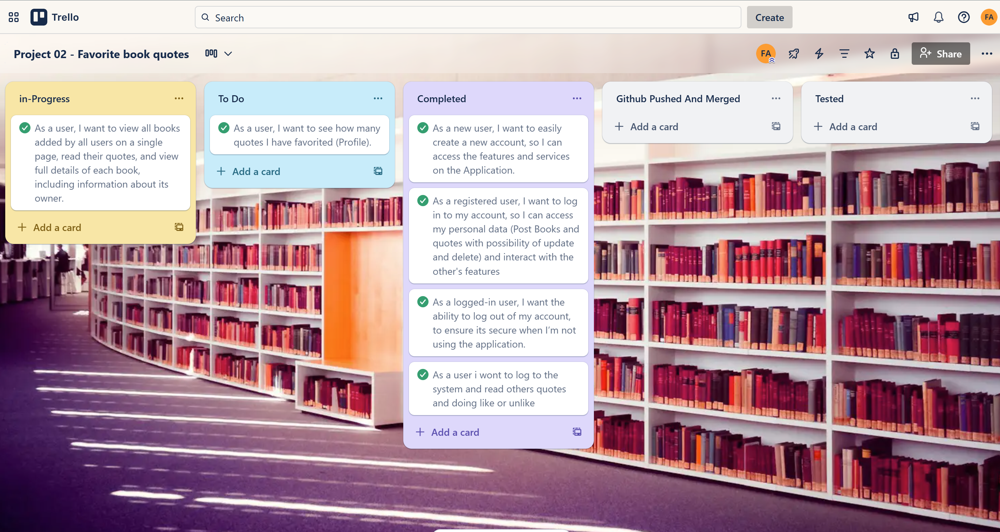
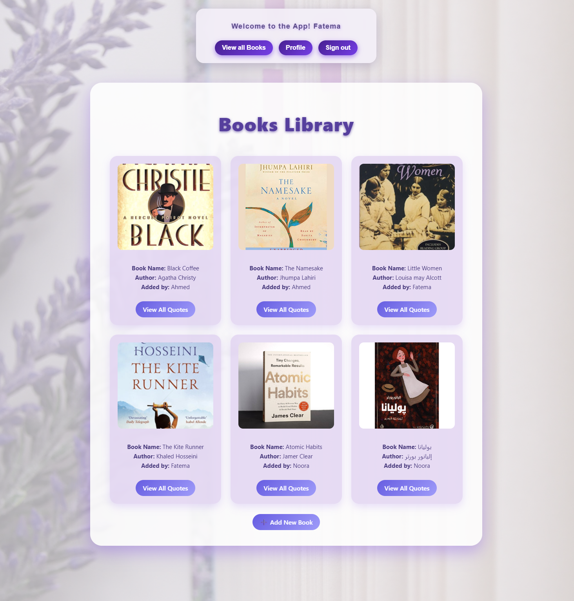
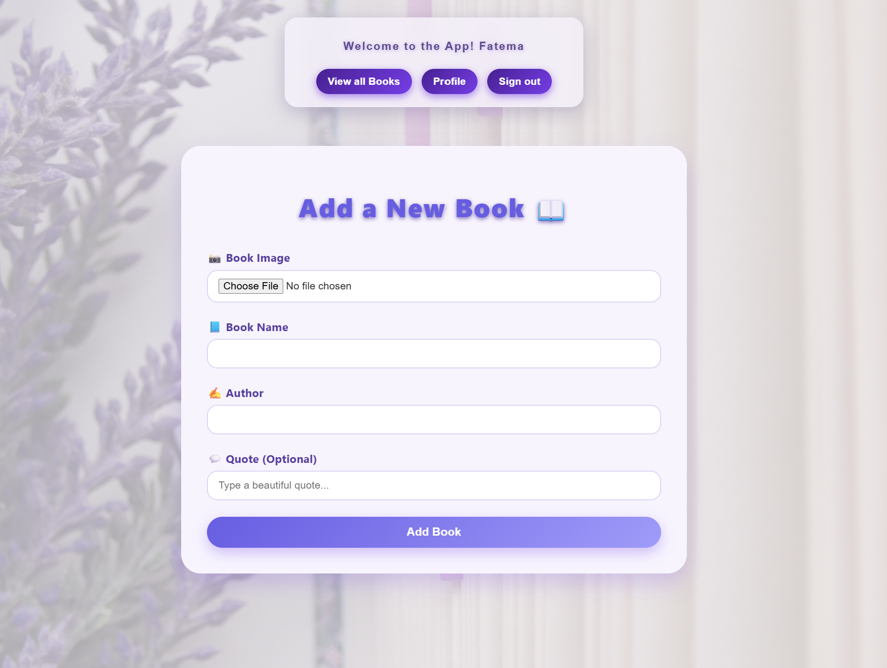

# 📚 Favorite Book Quotes

A web platform where users can share their favorite books, add quotes they love, and explore what other users are reading and sharing  Built with the MEN Stack + EJS and styled in a simple purple theme 💜.

---

## ✨ Features

- 📝 Add books with cover images
- 💬 Add quotes to each book
- ❤️ Like/Don't Like quotes
- 👥 See who added each book and view owner profile
- 🔐 Authentication (sign in/sign out)

## 🛠️ Technologies Used

###  I developed my project using the MEN Stack

- MongoDB 
- Express.js
- Node.js
- EJS (Embedded JavaScript Templates)
- HTML, CSS, custom styling
- Multer (for image uploads)
- bcrypt (securely hash user passwords)

[Live Demo](https://favorites-book-quotes.onrender.com)

### Here are some details about the implementation of my project

**1. Database Design (ERD)**

This ERD shows the main tables in the project and how they are related to each other  
It shows the main entities such as **Books**, **Quotes**, and **Users**, along with their relationships and key attributes.

You can view the detailed ERD image below or click [here](https://lucid.app/lucidchart/d7384785-3b0a-4475-a6c2-22dd6ae056c0/edit?page=0_0&invitationId=inv_7c572d3d-2d40-478f-8e6e-b9dcc741fc01#) to see the full diagram online.

**2 . 📋 Project Planning with Trello**

At the srart of the project, i created a task plan using [Trello](https://trello.com/b/fjbBzWnu/project-02) , which helped me save time and stay organized.
Trello allowed me to clearly arrange and manage tasks visually, making the development process more efficient — as shown in the image below

 

**3. 🎨 Initial Design with Figma**

After planning, I created a basic design for the project using [Figma](https://www.figma.com/deck/gTX2Pksl2IoOuTrAZm6G1B/Untitled?node-id=1-30&t=UQyWEEWZXdkjPOkz-1&scaling=min-zoom&content-scaling=fixed&page-id=0%3A1) .
This step helped me visualize the layout and understand how I wanted the structure and interface of my project to look — as shown in the image below

 

 

***

## The Main Features in Book Quotes Platform

 🖼️ **User Interface**  
 I designed a clean and simple interface to make the experience easy and enjoyable.

 🔐 **User Authentication**  
Users can register and log in securely.  
Passwords are hashed using `bcrypt` to protect user data.

 📚 **Add a Book**  
 Users can upload book covers and enter the book's name and author name .

 💬 **Add Quotes**  

Users can add their favorite quotes and connect them to specific books.  
This helps in organizing quotes based on the book source.

 

🔄 **Update Feature** 

Users can update or edit the name of book , Autor name or book image.  
This is useful if they want to fix a typo .

 
  

 ❤️ **Like Feature**  
 Other users can like quotes, and the total number of likes is saved and shown.

  

   

👤 **User Profile Page**  
Each user has a personal profile page where they can view the books they have added, as well as the books and quotes they have liked

## Online Resources

 * [GA](https://generalassembly.instructure.com/) :  it guides me building a MEN (MongoDB, Express.js, Node.js) stack application .
 
 * [npm](https://www.npmjs.com/package/multer) : help me for using multer.

 * [Medium](https://ehssanelmedkouri.medium.com/my-favorite-quotes-from-your-second-life-begins-when-you-realize-you-only-have-one-ca39e283ca0f): ideas and information.

 * [unsplash](https://unsplash.com/s/photos/book-background): the cute bachground in my app.

